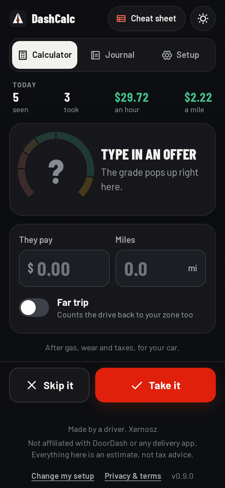
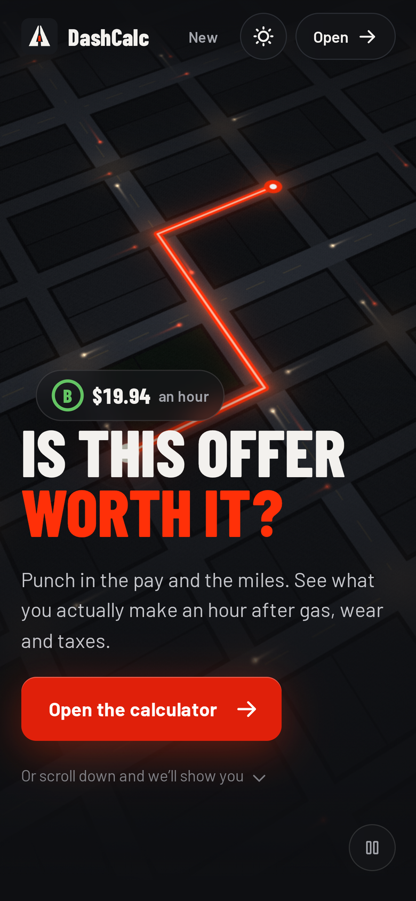
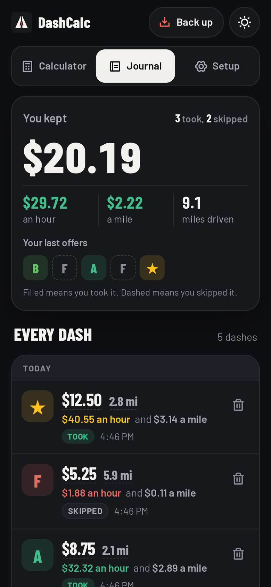
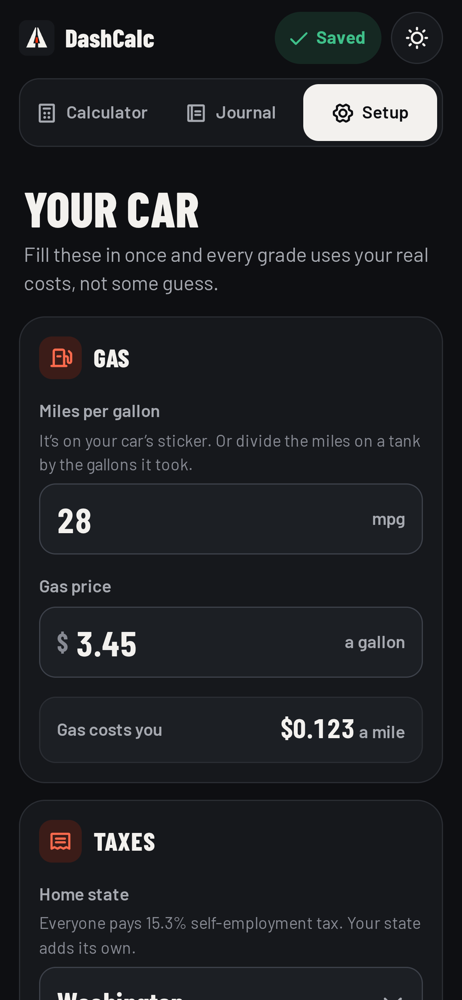

  
  <h1>DashCalc</h1>
  
<b>An open-source, privacy focused web-app to calculate and track delivery app earnings. You get a suite of features with no ads and no paywall!</b>

  
  

    <a href="https://xernosz.github.io/DashCalc/">Open DashCalc</a> ·
    <a href="#how-it-works">How it works</a> ·
    <a href="https://xernosz.github.io/DashCalc/legal.html">Privacy &amp; terms</a>
  

## Open it

All you need is a browser! Just head to [xernosz.github.io/DashCalc](https://xernosz.github.io/DashCalc/) and get to delivering! There's no accounts, no passwords, just seamless on-the-fly calculations.

You can add the site to your phone's home screen as a shortcut for quicker access:

- **iPhone:** Safari > Share > Add to Home Screen
- **Android:** Chrome > ⋮ menu > Add to Home screen

## Before and after

| The delivery app shows | DashCalc says |
| --- | --- |
| $4.25 for 6.1 miles | F: you lose $1.09 an hour |
| $11.00 for 3.4 miles | A: you keep $29.50 an hour |

> [!IMPORTANT]
> Please don't use the app while you are operating a vehicle, pull over, your safety means everything to us. All calculations are estimates and cannot be used one-to-one for tax purposes.

## How it works

1. Open the website and set up your vehicle's information
2. Put in an offer
3. It separates gas, tax, & other maintenance fees you pay
4. Shows the true pay
5. What's left per hour becomes a grade:      

## What it will never do

- **We don't access your delivery accounts.** These apps have policies against it, and don't have any API for us to use and grab your offers from, until something like that is released, gotta type em in manually.
- **None of the info you type leaves your hardware.** Every field you input gets saved to your phone, not my servers, not GitHub's. Your personal information is safe.
- **We collect one piece of data...** Your usage! I love to see people using my app, so I implemented a secure, and private visit counter to track how many people visit and use the site weekly. You can turn off the tracking in the setup, but I'd appreciate if you don't! [Here's exactly what it counts.](https://xernosz.github.io/DashCalc/legal.html#counting)

## Screenshots

  
  
  

## About

This is my first ever large scale programming project, I started making discord bots for small servers at 12, now I'm 19 here developing my own app! So I won't lie to you, AI handles a large portion of the HTML, CSS, and animations. I don't like designing things nor do I describe myself to be very "creative", so feeding Claude instagram reels about design strategy at 4am is the fuel behind the whole site redesign. All the scripting, important aspects, and soul, is straight from ya boy Xernosz.

If DashCalc helps you, you can tip me on [Ko-fi](https://ko-fi.com/zakkary).

License: [AGPL-3.0](LICENSE)

Always, keep learning.